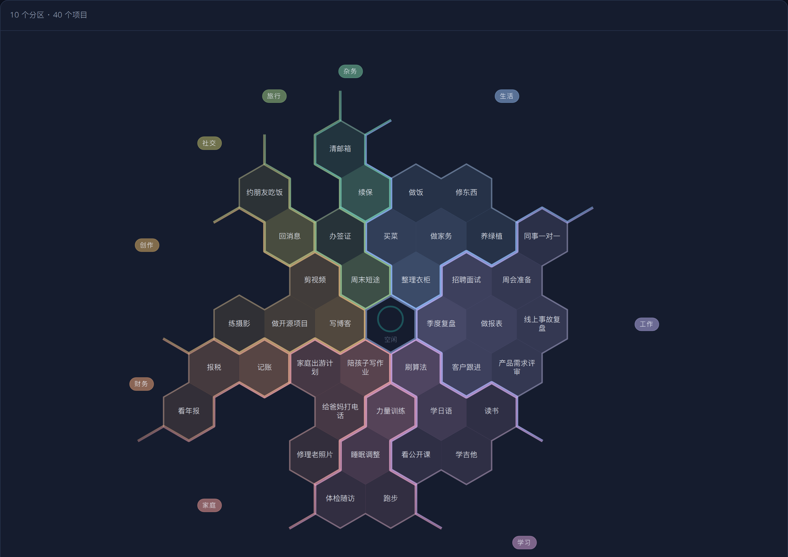
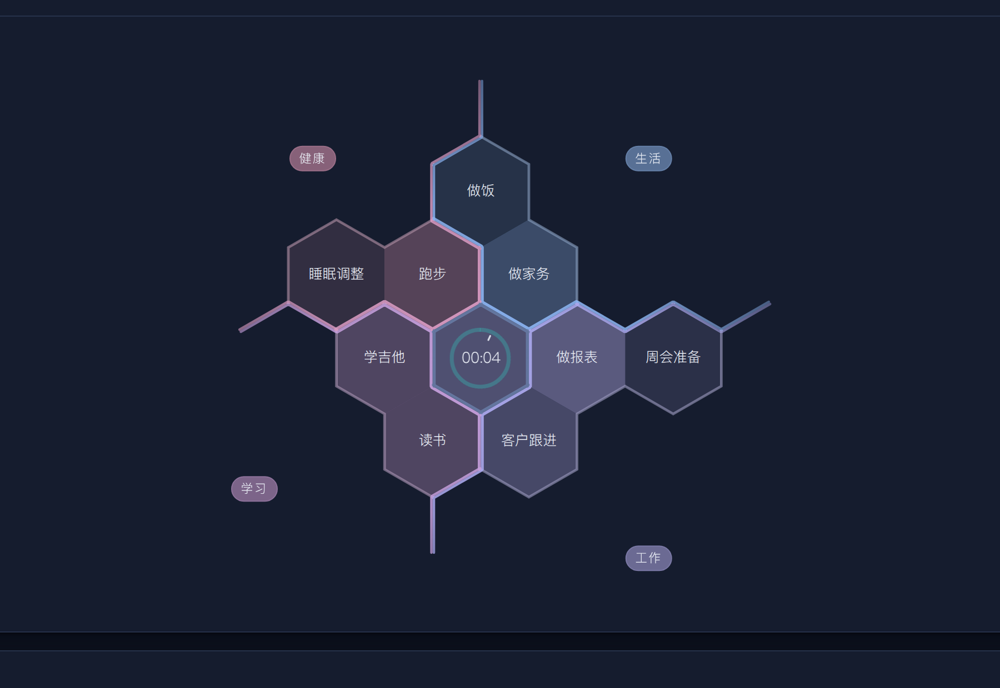
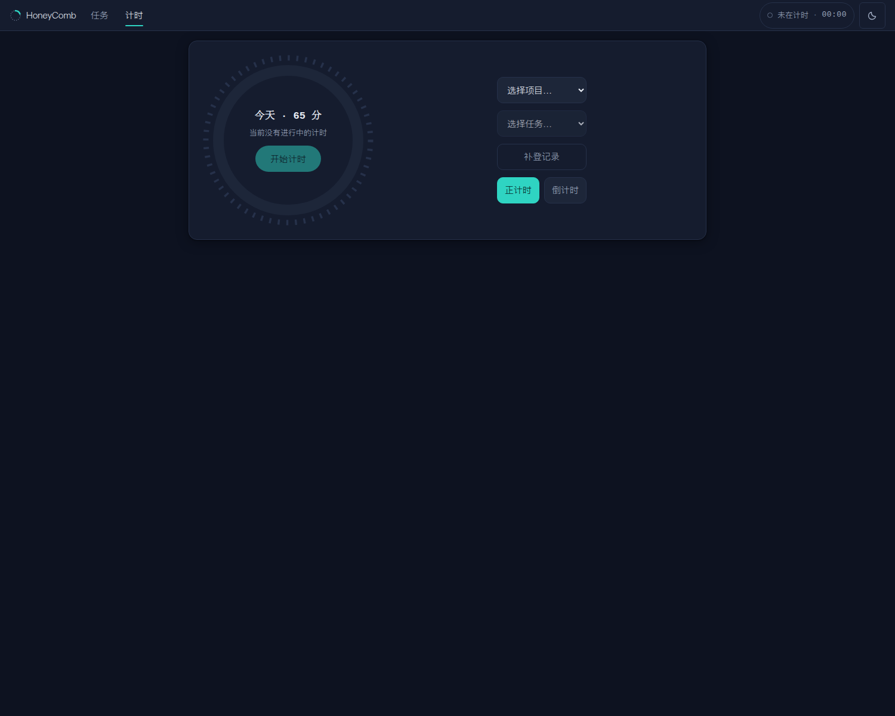
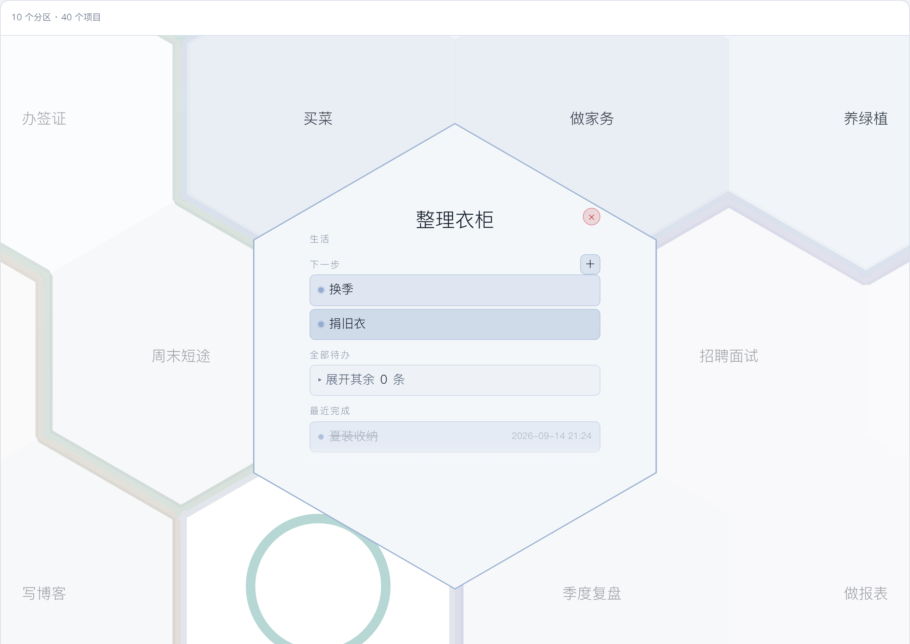
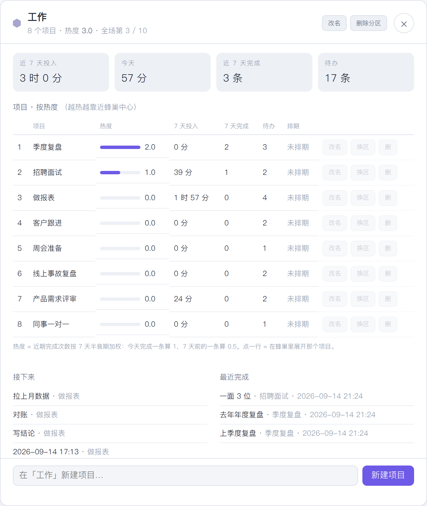
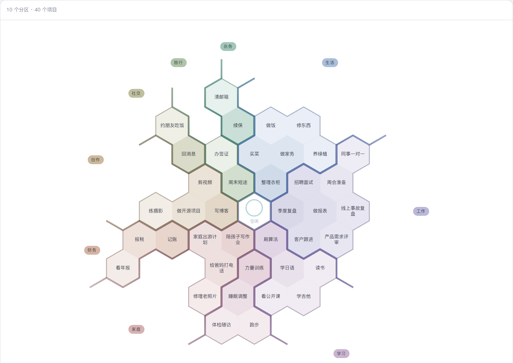

<div align="center">

# 🍯 HoneyComb

**把你的项目摊成一张蜂巢，中间那一格是正在走的表。**

[](LICENSE)




</div>

---

## 60 秒看懂这张图

时间管理工具几乎都长成一条时间轴或一张表格。它们是**一维**的——看完就忘。

蜂巢是**二维**的：每个项目占一格，位置本身带信息。

| 你看到的 | 它在说什么 |
|---|---|
| 一块颜色 | 一个分区（生活 / 工作 / 学习…），占圆周上一个扇区，扇区角度 ∝ 项目数 |
| 离中心的远近 | 热度。最近完成得多的项目自动往里坐 |
| 颜色的浓淡 | 同一件事：越靠内越浓 |
| 正中那一格 | **正在走的表**。没在计时就是「空闲」 |
| 飘向某一格的粒子 | 时间正在流进那个项目 |

所以你不用读，扫一眼就知道：**这段时间我的注意力堆在哪个方向。**
人记得住"那块地在西北角、颜色很深"，记不住列表里的第 17 行。

> 上图是演示数据：10 个分区、40 个项目。跑 `python3 seed/seed_demo.py --big` 就能复现。

## 它是什么

一个单人用的时间管理系统。一张蜂巢、一块表、一页回顾：

- **任务**：所有项目排成蜂巢。每个分区占一个扇区，越靠近中心的格子热度越高、颜色越深。
  长按一格就开始给它计时，被按的那一格会像 macOS 收进程序坞那样被吸进中间的圆环。
- **计时**：一块表盘，停止 / 暂停 / 取消不记录。
- **回顾**：一周过完，看计划和实际差在哪、什么过期了、什么久没动了。

中间那一格是**当前计时**：分针一圈 60 分钟，白色短针是秒针，数字翻牌跳字，
计时期间有稀疏的半透明粒子从圆环飘向正在计的那个项目格。

## 它记的是什么

**只记发生过的事**。停表会写一条 `session.completed` 事件（谁、什么时候开始、干了多久），
这条流水只追加、不修改、不删除。所有统计——项目投入、分区热度、进度百分比——都是从这条流水
现算出来的**投影**，不是另存一份可以偷偷改的数字。

「取消不记录」就是真的不记：它不产生任何事件。
「暂停」是纯前端的：停表那一段照常入账，继续时接着上次的累计往下走。

## 快速开始

需要 Docker 和 Docker Compose。

```bash
docker compose up -d          # 起 mongo + api + web
python3 seed/seed_demo.py     # 可选：塞一批演示数据（做家务、做报表……）
```

然后开 <http://127.0.0.1:8800/>。

停：`docker compose down`（数据留着）。连数据一起删：`docker compose down -v`。

想换端口或者绑到局域网，改环境变量：

```bash
HONEYCOMB_BIND=0.0.0.0:8800 docker compose up -d
```

> 反代在前面时注意：本项目的 nginx 配置里开了 `absolute_redirect off`，跳转用相对 Location。
> 开着默认值的话，`http://IP:8800/` 的 302 会跳到 `http://IP/table/`（丢端口），看起来就是"自动跳转然后 502"。

⚠️ **v0.1 没有登录**。默认只绑回环地址（`127.0.0.1`），是单机自用的定位。
要放到局域网或公网，请自己在前面加一层带认证的反向代理。

## 长什么样

| 正在计时 | 计时台 |
|---|---|
|  |  |

| 点开一格 | 短按分区名 |
|---|---|
|  |  |

亮色主题跟随系统：



## 怎么用

| 操作 | 结果 |
|---|---|
| 长按项目格 | 建一条以「日期 时间」命名的子任务并开始计时 |
| 长按格子里的待办卡片 | 直接给这条已有任务计时 |
| 鼠标放到中心格（触屏点一下） | 出现 完成 / 暂停 / 取消不记录 三个键 |
| 点中心格上半部分 | 进计时台 |
| 短按分区名 | 打开分区规划：热度、近 7 天投入、项目排行、接下来做什么；分区改名 / 删分区、项目改名 / 换区 / 删项目也在这里 |
| 长按分区名 | 进编辑模式，拖着换分区的方位，松手落位 |
| 长按蜂巢外的空白 | 在那个方向长出一格，新建项目 |
| 双击分区名 | 恢复后端给的默认顺序 |
| 顶部「回顾」 | 每周回顾：本周计划 vs 实际、过期项目、久未动任务；点一条直接跳到它的编辑弹窗 |

## 结构

```
api/    FastAPI + MongoDB。事件流 + 投影，计时与任务的全部逻辑
web/    零构建的前端：原生 JS，没有框架、没有打包器，改完刷新就生效
nginx/  唯一入口：/table/ 蜂巢，/ring/ 计时台，/api/ 反代到后端
seed/   演示数据脚本（纯标准库）
docs/   架构说明 + 演示顺序（DEMO.md）
```

前端不需要 node，不需要 npm install。所有文件都是浏览器直接能跑的。

## 版本

v0.1 —— 第一版开源。蜂巢 + 计时台 + 每周回顾：甘特、收件箱、待办清单、AI 规划、
优先级权重这些都不在这一版里。旧的「经典列表」视图 2026-09-14 整个删掉了，
它独有的那几条写路径（分区改名/删分区、项目改名/换区/删项目）已经搬进分区规划面板。

## 它不是什么

诚实登记，免得你装完才发现：

- **单人用**。没有多用户、没有权限、没有团队报表和发票。
- **手动计时**。不监控窗口、不自动追踪（那是 ActivityWatch 的活）。
- **没有移动端 App**。页面是响应式的，但没打包成 App。
- **v0.1 没有登录层**，默认只绑 `127.0.0.1`。要暴露到公网请自己加一层认证。
- 数据量非常大时"全部现算"的性能还没压测过。

## 许可

MIT，见 [LICENSE](LICENSE)。
