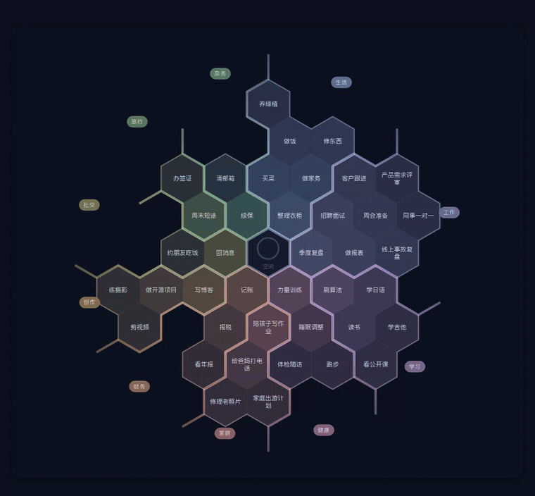
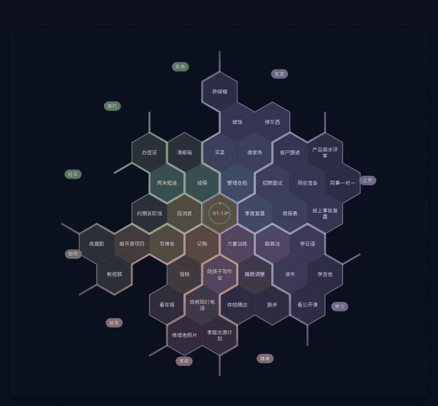
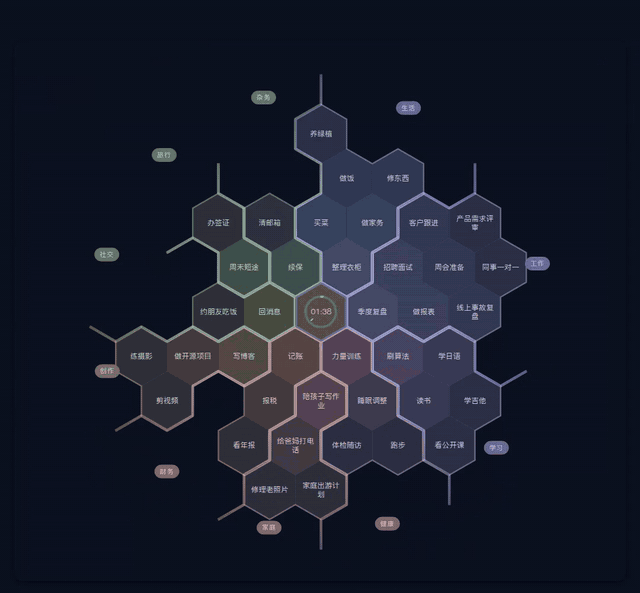

<div align="center">

# HoneyComb

把项目摊成一张蜂巢，中间那一格是正在走的表。

[](LICENSE)




*鼠标扫过一格就放大，露出它的下一步；长按，那一格被吸进中间的圆环，表开始走。*

</div>

## 功能

- **蜂巢视图** —— 每个分区占圆周上一个扇区，扇区角度按项目数分。最近做得多的项目自动往中心坐，颜色也更浓。
- **长按开始计时** —— 按住哪一格，时间就流进哪一格。中心圆环一圈 60 分钟，计时期间有粒子从圆环飘向那一格。
- **只记发生过的事** —— 停表写一条只追加的 `session.completed` 事件。所有统计都是现算的投影，没有一个可以被偷偷改的数字。「取消不记录」真的一个字都不写。
- **分区规划** —— 短按分区名：热度排行、近 7 天投入、接下来做什么；项目改名、换区、删除也在这里。
- **每周回顾** —— 本周计划 vs 实际、过期项目、久未动的任务，点一条直接跳过去处理。
- **零构建前端** —— 原生 JS，不装 node_modules，不配打包器，改完刷新就生效。

## 快速开始

```bash
docker compose up -d          # mongo + api + web
python3 seed/seed_demo.py     # 可选：一批演示数据
```

打开 <http://127.0.0.1:8800/>。

```bash
python3 seed/seed_demo.py --big          # 大盘：10 分区 40 项目
HONEYCOMB_BIND=0.0.0.0:8800 docker compose up -d   # 绑到局域网
docker compose down                       # 停（数据留着）
```

## 怎么用

**点开一格** —— 展开成一张卡：下一步、全部待办、最近完成。点一条待办露出完成 / 改名 / 补登 / 删；点标题直接改项目名。



**短按分区名** —— 打开分区规划：热度排行、近 7 天投入、接下来做什么、最近完成了什么。



其余手势：

| 操作 | 结果 |
|---|---|
| 长按格子里的待办卡片 | 直接给这条已有任务计时 |
| 鼠标停在中心格 | 出现 完成 / 暂停 / 取消不记录 |
| 点中心格上半部分 | 进计时台 |
| 长按分区名 | 编辑模式，拖着换分区方位 |
| 长按蜂巢外的空白 | 在那个方向长出一格，新建项目 |
| 双击分区名 | 恢复默认顺序 |

## 结构

```
api/    FastAPI + MongoDB，事件流 + 投影
web/    原生 JS 前端，浏览器直接跑
nginx/  唯一入口：/table/ 蜂巢，/ring/ 计时台，/api/ 反代
seed/   演示数据脚本（纯标准库）
docs/   架构说明（ARCHITECTURE.md）、演示顺序（DEMO.md）
```

v0.1 默认只绑回环地址，单机自用。要放到局域网或公网，请自己在前面加一层带认证的反向代理。

## 许可

MIT，见 [LICENSE](LICENSE)。
